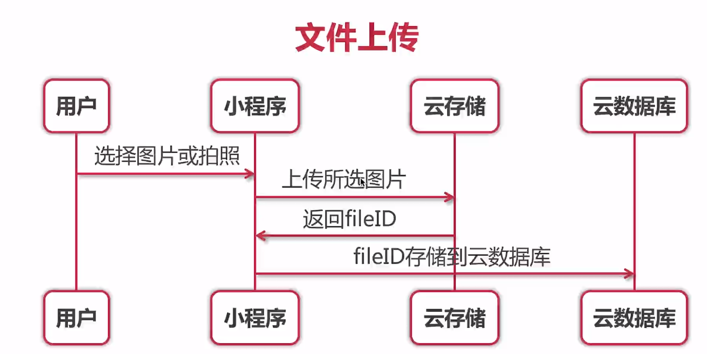

## 主体内容

- 代码构成 
  - 数据:JSON 配置文件
  - 结构:WXML 模版文件
  - 样式:WXSS 页面样式
  - 交互:JS 脚本逻辑文件
- 云开发
  - 云数据库
  - 云函数
  - 云存储

### WXML

是小程序框架设计的一套标签语言，结合小程序的基础组件，事件系统，可以构建出页面的结构，充当的就是类似HTML的角色

- 常见组件
  - `<view></view>`类似于div
  - 胡子语法{{}}插值 
  - 数据存储在base.js文件中

- 列表渲染
  - wx:for {{index}} {{item}}
  - wx:key

- 条件渲染
  - 使用wx:if="{{condition}}" 来判断是否需要渲染该代码块, 也可以用wx:elseif和wx:else来添加一个else块
  - wx:if vs hidden : 如果需要频繁切换的情景下,用hidden更好,如果在运行时条件不大可能改变则 wx:if 较好

### WXSS

- WXSS(WeiXin Style Sheets)是一套用于小程序的样式语言,用于描述WXML的组件样式,也就是视觉上的效果。

- 尺寸单位:rpx(responsive pixel) 可以根据屏幕宽度进行自适应, 适配不同宽度的屏幕 (规定屏幕宽度为750rpx)
- 建议使用iphone6作为设计稿标准
- 引入外部wxss: @import './test_0.wxss'

- 推荐使用小程序第三方样式库
  - WeUI :一套同微信原生样式视觉体验一致的基础样式库
  - iView Weapp:一套高质量的微信小程序UI组件库 可构建后台管理系统
  - Vant Weapp:轻量、可靠的小程序UI组件库

## JS

- 事件机制

  - 事件是对用户的交互操作行为的相应
  - bind VS catch : bind允许事件冒泡 catch不允许事件冒泡
  - 事件对象event

  

## 微信小程序>云开发

腾讯云 + 微信小程序 

- 云函数
- 云数据库
- 云存储

​    

### 小程序传统开发模式

开发成本比较高 开发效率低 运维成本高

- 客户端
- 服务端
  - 后端代码
  - 数据库

- 运维

###小程序云开发模式

Serverless 开发者更关注业务逻辑

- 客户端 + 云开发 减低成本

- 不需要运维成本 

### 云函数

- 获取appid
- 获取openid
- 生成分享图
- 调用腾讯云SDK

### 云数据库

- 数据增删改查

### 云存储

- 管理文件
- 上传文件
- 下载文件
- 分享文件

### 基础环境

个小程序帐号可免费创建两个环境建议:

- 开发环境

- 生产环境

> 调试基础库版本应在 2.2.3 以上版本

### 云数据库能力

云开发提供了一个JSON数据库 提供了2GB免费存储空间

#### 数据类型

- String: 字符串
- Number: 数字
- Object:对象
- Array:数组
- Bool: 布尔值
- GeoPoint : 地理位置点
- Date : 时间
- Null 

#### 操作云数据库

- 小程序控制(读写数据库受权限控制限制)

- 云函数控制(拥有所有读写数据库的权限)
- 控制台控制(拥有所有读写数据库的权限)

#### 云数据库权限管理

- 仅创建者可写, 所有人可读(文章类)

- 仅创建者可读写
- 仅管理端可写
- 仅管理端可读写

#### 数据库初始化

初始化

```js
const db = wx.cloud.database()
```

切换环境

```js
const testDB = wx.cloud.database({
    env:'test'
})
```

选择云开发的编译路径

#### 通过云开发实现增删查改

```
db.collection('name').doc('id')add() or ...
```

  ### 云函数

调用云函数的方法:

```js
	 wx.cloud.callFunction({
         name: '',
         data:{}
	 }).then(res => {}).catch()
```

### 云存储

能力

- wx.cloud.uploadFile 上传文件
- wx.cloud.downloadFile 下载文件
- wx.cloud.deleteFile 删除文件
- wx.cloud.getTempFileURI 获取临时链接

实例

```js
upload: function (){
    //选择图片api wx.chooseImage()
    wx.chooseImage({
        count: 1,
        sizeType:['original','compressed'],
        sourceType: ['album','camera'],
        success(res) {
            //tempFilePath 可以作为img标签的src属性显示图片(图片的临时路径)
            const tempFilePaths = res.tempFilePaths;
         //调用云存储api 上传文件 wx.cloud.uploadFile
            wx.cloud.uploadFile({
                cloudPath: new Date().getTime()+'.png'//上传到云储存的路径
                filePath:'tempFilePaths[0]'// 文件路径 因为tempFilePaths为数组
                success:res => {
                    console.log(res.fileID)
                    db.collection('image').add({
                        data: {
                            fileID: res.fileID
                        }
                    }).then(res => {
                        console.log(res);
                    }).ctach( err => {
                        console.error(err);
                    })
            	},
        		fail:console.error
    		})
   		}
 	})    
}
```




拉取云存储到页面

```javascript
getFile(){
    wx.cloud.callFunction({
        name:'login',
    }).then(res => {
        db.collectin('image').where({
            _openid:res.result.openid
        }).get().then(res2 => {
            console.log(res);
            this.setData({
            //将拉取结果传给data中的images
                images: res2.data
            })
        })
    })
}
```

文件下载

cloud.wxml:

~~~php+HTML
<block wx:for="{{images}}">
	<image src="{{item.fileID}}"></image>
	<button data-fileid="{{item.fileID}} 
	bind:tap="downloadFile>文件下载</button>
</block>
~~~

cloud.js:

```js
downloadFile(event){
    wx.cloud.downloadFile({
        fileID:event.target.dataset.fileid,//所需下载文件名
        success: res => {
            //返回临时文件路径
            console.log(res.tempFilePath)
            //把当前文件保存到手机相册
            wx.saveImageToPhotosAlbum({
                filePath: res.tempFilePath,
                success(res => {
                   //自动消失的提示框
                    wx.showToast({
                        title:'保存成功'
                    })
                })
            })
        },
        fail: console.error
    })
}
```


