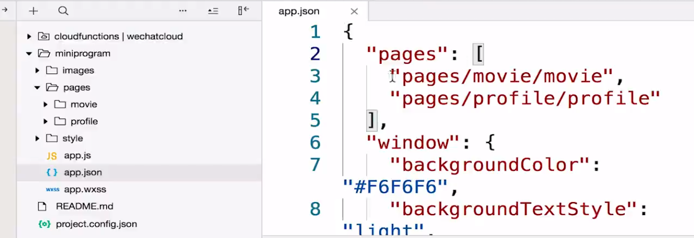
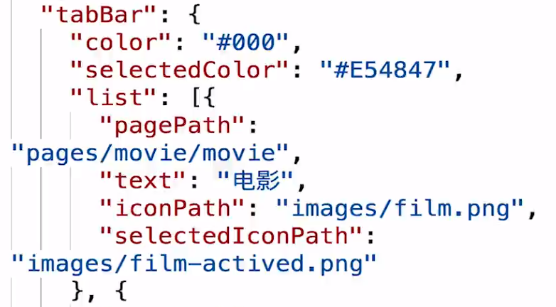
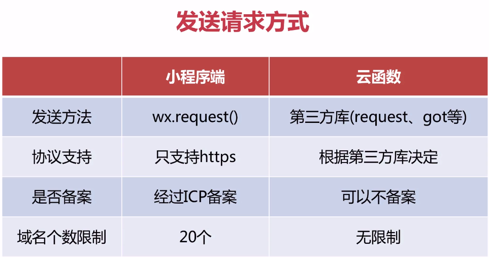
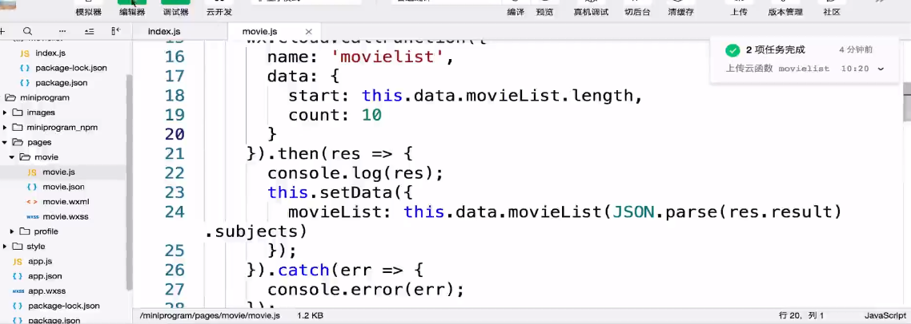
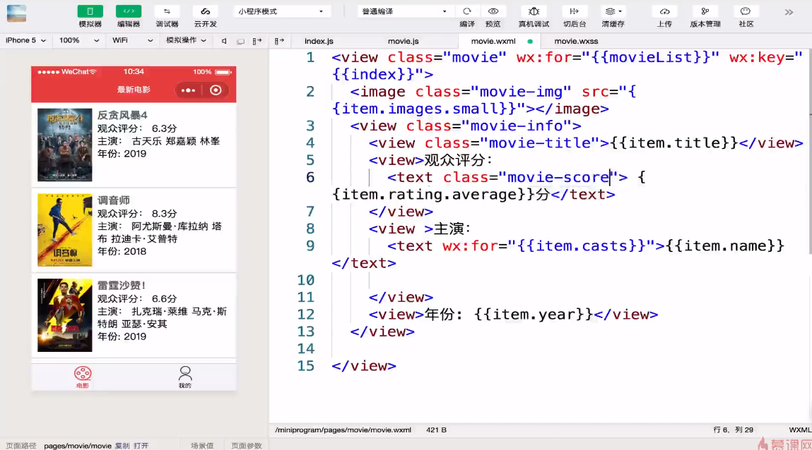
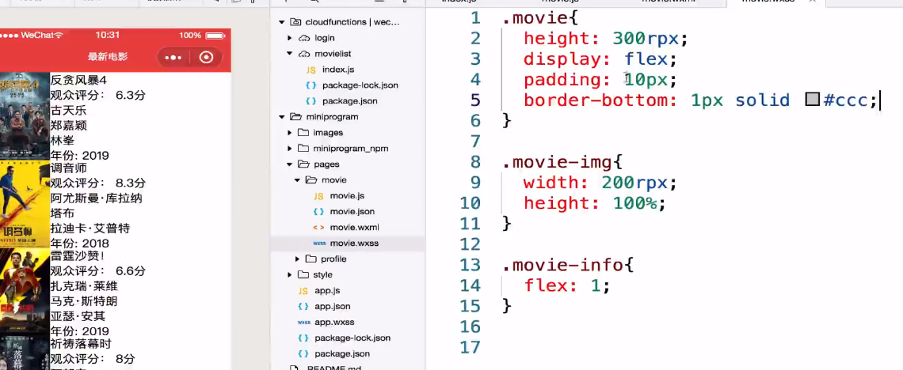

## 电影小程序案例

**电影信息首页**

- 调用豆瓣api接口获取真实数据
  - 每次加载10条数据
  - 下拉异步加载10条数据
  - 点击评价进入电影详情页面

**项目初始化**

- 首先配置两个page : movie profile
  - 
- 配置全局外框样式
  - app.json中配置相应样式

- 配置tabBar
  - 配置对应路由(页面)
  - 配置对应按钮和文字样式
  - 

### 引入第三方组件库 

- UI库使用 Vant weapp

  - 在nimiprogram文件夹中 npm init

  - 安装Vant weapp

  - 工具 - 构建npm

  - 详情页勾选使用npm模块

### 在小程序端发送请求



### 使用云函数发送请求

- 在云函数下面创建相关云函数

- 在云函数目录下引入第三方库

- 在云函数下调用api

- 

- 上传并部署云函数

- 在客户端调用云函数

- 

- 

- 页面设置
  - 

- 设置样式
  -  

###电影详情页面

- 添加评价按钮

- 配置详情页面路由
- 给按钮绑定跳转事件跳转到commit页面

```
wx.navigateTO(Object object)
```

- 创建一个新的云函数 用来拉取详情页面的信息
- 在commit页面调用该云函数并传值

- 添加vant组件
- 构建信息页样式

### 电影评价模块

- 绑定提交事件
- 存储用户评价信息
- 云存储评价图片 完成后传回一个fileId
- 然后将用户评价相关信息fileId以及电影索引传到云数据库

### 用户信息模块

- open-data
- button 微信开放能力